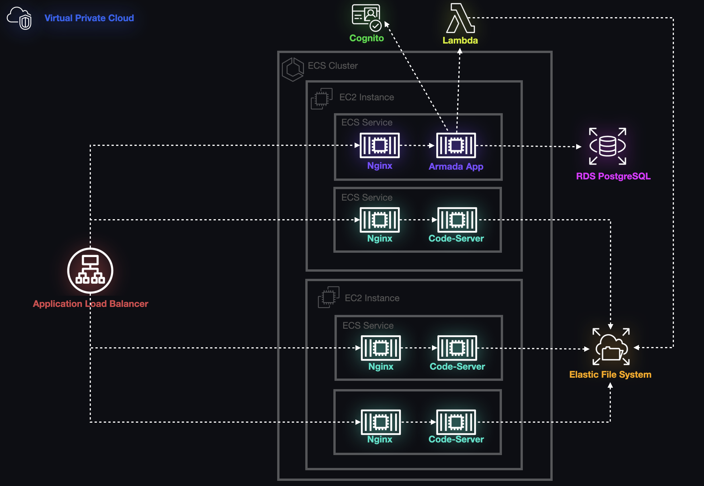

# Armada Infrastructure

> The below diagram shows the full architecture that Armada will deploy on AWS. Release the Fleet! 



## Environment variables 
To deploy Armada you must add the following environment variables to your `~/.zshrc`, `~/.bashrc` or add them to a `.env` file. 
```sh
ADMIN_NODE_KEY_PAIR_NAME='my-us-east-2-key-pair'
AWS_DEFAULT_REGION='us-east-2'
AWS_AVAILABILITY_ZONE='us-east-2a'
AWS_ACCESS_KEY_ID=""
AWS_SECRET_ACCESS_KEY=""
CDK_DEFAULT_ACCOUNT="your default aws account id"
CDK_DEFAULT_REGION="us-east-2"
```

---

## Environment Variables
```sh
ADMIN_NODE_KEY_PAIR_NAME='my-us-east-2-key-pair'
AWS_DEFAULT_REGION='us-east-2'
AWS_AVAILABILITY_ZONE='us-east-2a'
AWS_ACCESS_KEY_ID=""
AWS_SECRET_ACCESS_KEY=""
CDK_DEFAULT_ACCOUNT="your default aws account id"
CDK_DEFAULT_REGION="us-east-2"
```

## Running the app

> NOTE: You should have an AWS user with admin permissions. 

### Install CDK 
```sh
npm install -g aws-cdk
```

### Bootstrap CDK
```sh
cdk bootstrap 
```

### Deploy Infrastructure
```sh
cdk deploy
```
