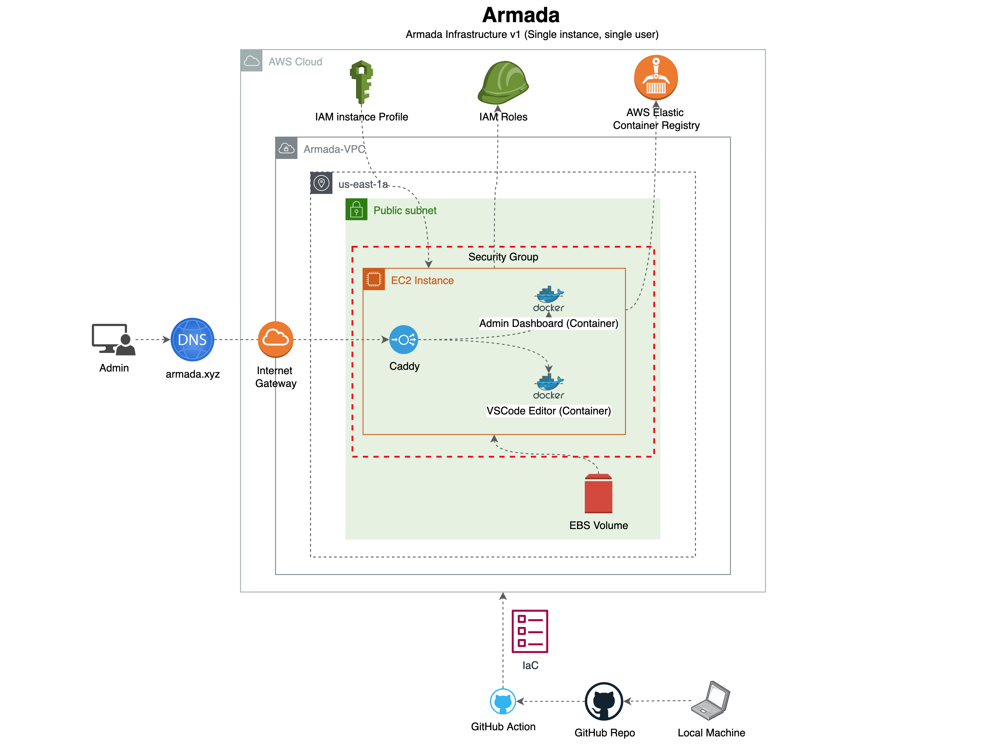

# Armada Infrastructure v1

> Release the Fleet!



## Environment variables 
To deploy armada you must add the following environment variables to your `~/.zshrc`, `~/.bashrc` or add them to a `.env` file. 
```sh
  ADMIN_NODE_KEY_PAIR_NAME='my-us-east-2-key-pair'
  AWS_DEFAULT_REGION='us-east-2'
  AWS_AVAILABILITY_ZONE='us-east-2a'
  AWS_ACCESS_KEY_ID=""
  AWS_SECRET_ACCESS_KEY=""
  CDK_DEFAULT_ACCOUNT="your default aws account id"
  CDK_DEFAULT_REGION="us-east-2"
```

## AWS CloudFormation, AWS CDK and Terraform Comparison Chart

| Variables               | Terraform                                    | CloudFormation      | Cloud Development Kit                  |
| ----------------------- | -------------------------------------------- | ------------------- | -------------------------------------- |
| Graphic Interface       | Enterprise GUI (Paid)                        | Graphic Designer    | No                                    |
| Supported Languages     | HashiCorp Configuration Language (HCL), JSON | YAML, JSON          | Programming Language (e.g. TypeScript) |
| Extensibility           | Terraform Modules                            | Nested Stacks       | Same as CFN                            |
| Testing                 | Yes (3rd party packages)                     | Yes                 | Yes                                    |
| Configuration Drift     | Yes (Paid)                                   | Yes (Free)          | Yes (Free)                             |
| Resource Creation Limit | ?                                            | 500 Stacks          | 500 Stacks                             |
| Multi-cloud Support     | Yes                                          | No                  | No                                     |
| Organization creation   | Yes (Paid)                                   | Yes (3rd party CLI) | yes (3rd party CLI)                    |
| State Management        | Stored in filesystem                         | Managed for you     | Managed for you                        |
| Reusability             | yes (Modules)                                | yes (but tedious)   | yes (Constructs)                       |


---

## Running the 

> NOTE: You should have an AWS user with admin permissions. 

### Install CDK 
```sh
npm install -g aws-cdk
```

### Install CDK 
```sh
cdk bootstrap 
```

### Deploy Infrastructure
```sh
cdk deploy
```


### Useful commands
* `npm run build`   compile typescript to js
* `npm run watch`   watch for changes and compile
* `npm run test`    perform the jest unit tests
* `cdk deploy`      deploy this stack to your default AWS account/region
* `cdk diff`        compare deployed stack with current state
* `cdk synth`       emits the synthesized CloudFormation template
